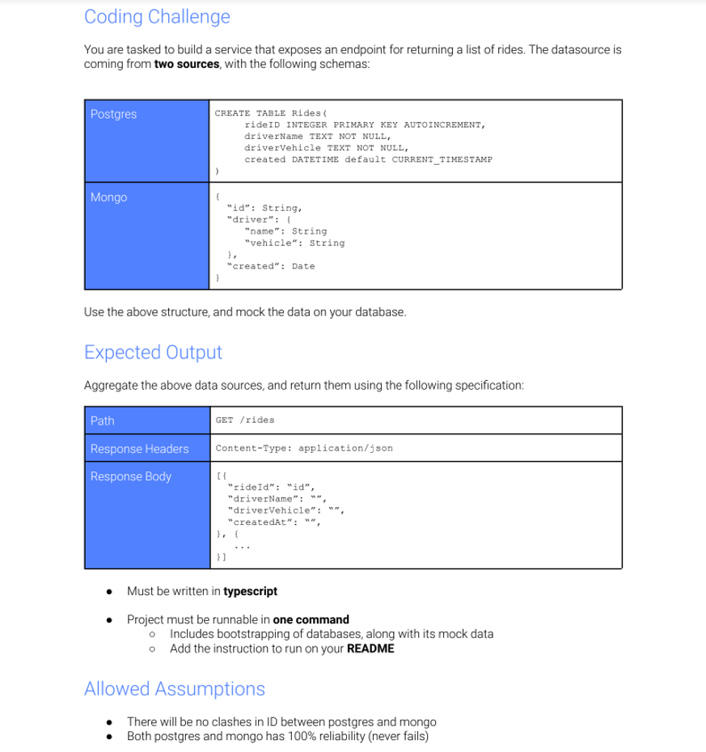

# rides-code-challenge



# System requirements

1. this was developed and tested with 
```
mongodb-win32-x86_64-windows-5.0.2
node v12.11.1
npm 6.12.0
```
2. you will need node and mongodb installed on your local machine running on port 27017
3. you won't need any sql database installed on your machine - it uses an embeded sqlite instance

# Instructions
1. make sure mongo is running on port 27017
2. go to your mongo instance bin folder and run the command below (replace YOUR_PROJECT_LOCAL_FOLDER with C:\YOUR_PROJECT_LOCAL_FOLDER with your local project folder)
```
PS C:\mongodb-win32-x86_64-windows-5.0.2\bin> mongoimport --db='rides' --collection='rides' --file=C:\YOUR_PROJECT_LOCAL_FOLDER\src\db\rides_mongo_seed.json
2021-09-15T21:01:45.211-0300    connected to: localhost
2021-09-15T21:01:45.237-0300    imported 8 documents
```
1. git clone de project
2. cd to project folder and run the commands below
```
npm install
npm start
```
3. you should see this log in your console
```
app running on http://localhost:3000
```
4. open [http://localhost:3000/rides](http://localhost:3000/rides) in your browser