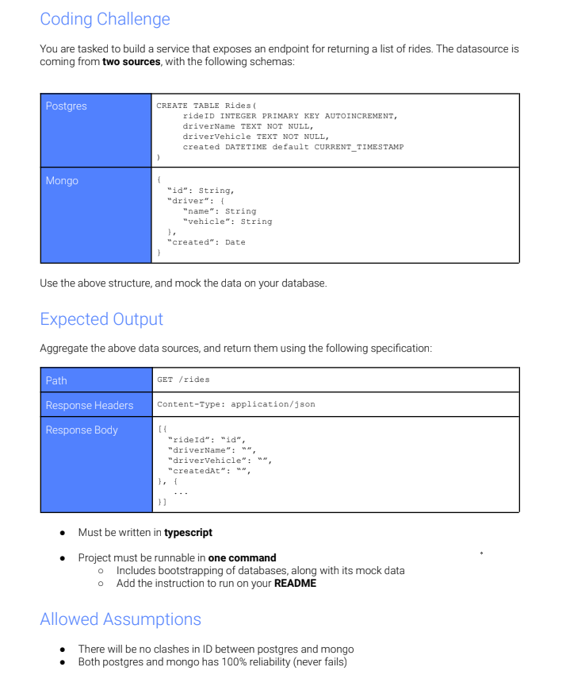

# Rides Code Challenge



# System requirements

1. this was developed and tested with 
```
mongodb-win32-x86_64-windows-5.0.2
node v12.22.0
npm 6.12.0
```
2. you will need node and mongodb installed on your local machine running on port 27017
3. you won't need any sql database installed on your machine - it uses an embeded sqlite instance

# Instructions
## To run the application
1. git clone de project
2. cd to project folder and run the commands below
```
npm install
npm start
```
3. you should see this log in your console


4. open [http://localhost:3000/rides](http://localhost:3000/rides) in your browser

## To run the tests
After you are done with steps 1 and 2 above you can run the tests scripts.
The project has 2 tests scripts: `unit.test.ts` and `integration.test.ts`
You can run them in separate by issuing `npm run unit-test` and `npm run integration-test`, or you can run both, one after the other, by calling `npm run test` as below:

